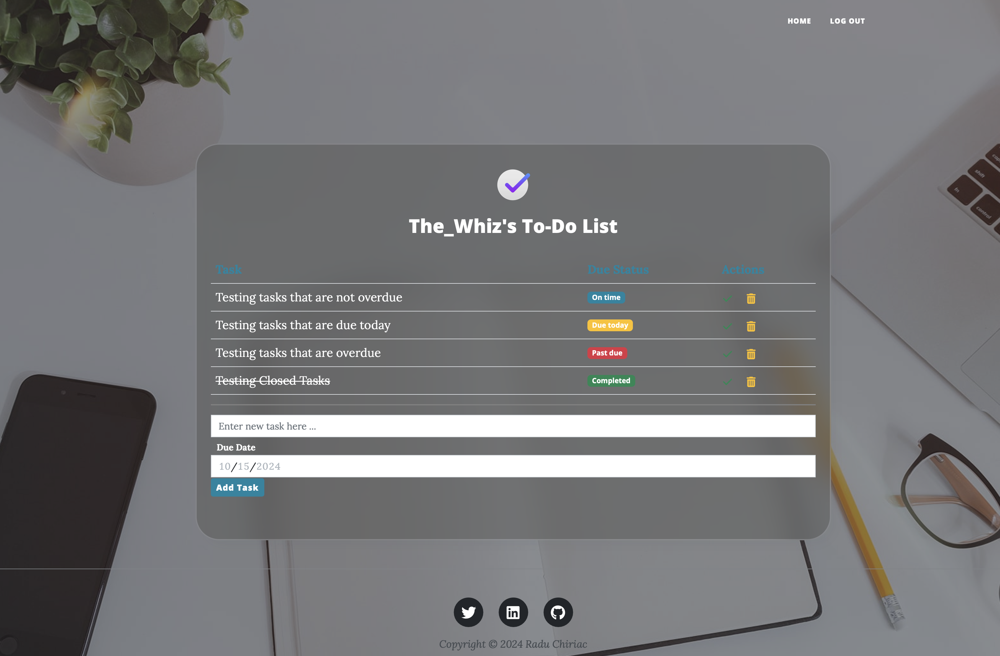
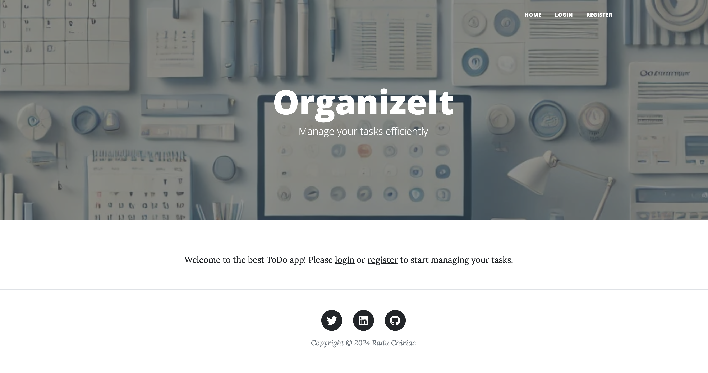

# To-Do App using Python and Flask

## Description
A simple to-do app built with Python using the Flask framework. The app allows users to create, edit, and manage their tasks. This project is part of my capstone project portfolio based on [100 Days of Code: The Complete Python Pro Bootcamp](https://www.udemy.com/course/100-days-of-code/) by Angela Wu.It is designed to showcase my skills in web development using Flask and various other technologies.

Current functionality only allows user to edit tasks in a single master to do list. For future improvements, I'd consider creating a functionality to manage different to do lists (like a traditional Reminders app) and viewing completed tasks. 

## Table of Contents
- [Usage](#usage)
- [Features](#features)
- [Future Improvements](#future-improvements)
- [Technologies Used](#technologies-used)
- [Live Demo](#live-demo)

## Usage
1. Run the app: `python main.py`
2. Open a web browser and go to `http://127.0.0.1:5000`
3. You will be greeted with a `Landing Page`
4. Use `Register` menu to create a user account  
5. You will be redirected to the `Home` page to add Tasks
6. Existing users can use the `Login` page to log in to their home page  
7. Interact with the app to create, resolve and delete your tasks.

## Features
- Create tasks with descriptions and due dates.
- Mark tasks as completed (which will also apply a strikethorugh and a `Completed` badge).
- Delete tasks that you no longer want and they will be removed from the page and database.

## Technologies Used
- Python
- Flask
- HTML
- SQL-Alchemy
- WTForms
- Bootstrap5 (CSS Framework)

## Live Demo
Website can be viewed and tested on <a href='https://flask-to-do-app-kappa.vercel.app'>Vercel.</a>